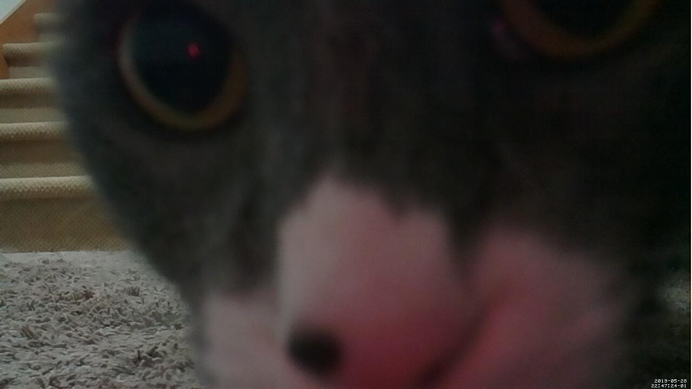

# BlueUDMotion 🎥 🐈 🐕

**Blue Motion** is a simple dashboard front-end for [Motion](https://motion-project.github.io/) using the free Community Edition of [PowerShell Universal Dashboard](https://universaldashboard.io/) from [Ironman Software](https://github.com/adamdriscoll)


## Features

1. Most of the basic Motion Web UI presented on a Dashboard - including the Live View and snapshot and motion detection controls.
2. Preview "Gallery" of captured images with "easy download"

## Setup

This setup assumes a Windows Machine running UD and a file share, and a Raspberry Pi running a basic Motion configuration...

1. Setup a Windows File Share on your Universal Dashboard Sever - Motion will deliver output to this folder and Universal Dashboard will publish this folder to the web interface.
2. Setup [PowerShell Universal Dashboard](https://universaldashboard.io/)
3. Mount the Share on Raspbian
  ``` bash
  sudo apt-get install cifs-utils
  sudo mkdir /mtn/MotionPics
  sudo mount -t cifs //YOURUDSERVER/Share/BlueUD /mnt/Motion -o user=username,pass=password,dir_mode=0777,file_mode=0777
  ```
4. Raspbian Setup: (More Detailed Steps Soon...)
    * Ensure the Camera is Enabled.
    * Install Motion
    * Configure Motion
      ``` bash 
      sudo nano /etc/motion/motion.conf
      ```
5. Run the UD Dashboard
6. Do some test Shots
7. Capture picture of your cats!


## Note
This project was created to help me figure out which cat was taking a dump in my basement - Motion is great software please support that project and do cool things with it!
